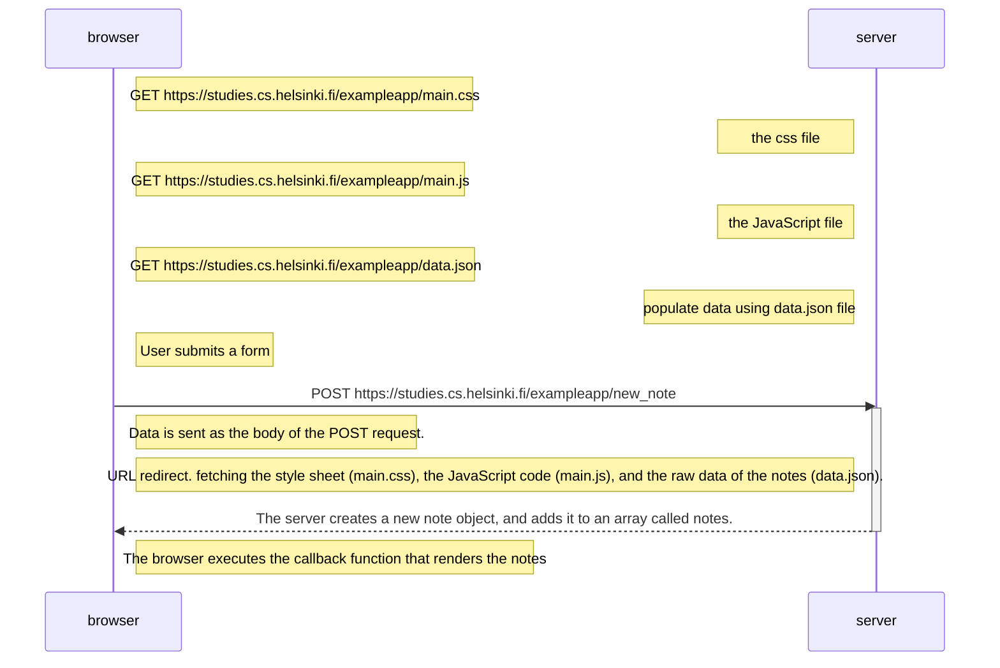

```mermaid
sequenceDiagram
    participant browser
    participant server

    Note right of browser: GET https://studies.cs.helsinki.fi/exampleapp/main.css
    Note left of server: the css file
    Note right of browser: GET https://studies.cs.helsinki.fi/exampleapp/main.js
    Note left of server: the JavaScript file
    Note right of browser: GET https://studies.cs.helsinki.fi/exampleapp/data.json
    Note left of server: populate data using data.json file

    Note right of browser: User submits a form

    browser->>server: POST https://studies.cs.helsinki.fi/exampleapp/new_note
    activate server
    Note right of browser: Data is sent as the body of the POST request.
    Note left of server:  URL redirect. fetching the style sheet (main.css), the JavaScript code (main.js), and the raw data of the notes (data.json).
    server-->>browser:  The server creates a new note object, and adds it to an array called notes.
    deactivate server

    Note right of browser: The browser executes the callback function that renders the notes
```
